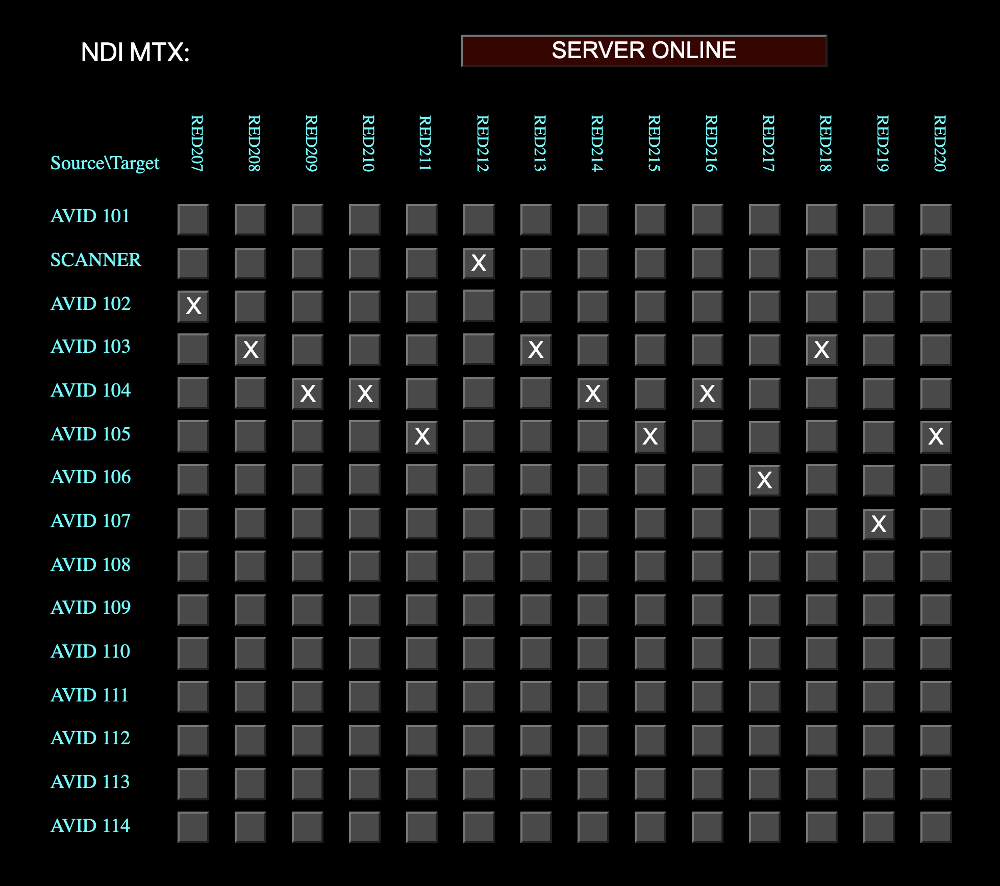

# NDI-EMBER-MTX

NDI Matrice with Ember control for NDI - VSM integration
The NDI MTX creates virtual targets (defined in target.json file) that you can select from your NDI Decoder (E.g. vMix or a Birddog)

It's build with static installations in mind, so it's not using discovering protocol for finding sources. But instead a static list in sources.json file.



## Installation: 
(ubuntu 20.04lts on Intel based machine)

### Setup in storage folder:
sources.json is the list of sources remember to add dnsName AND url
targets.json is the name of targets, you can add up to 100 in current configuration.

### Build and run:
ndi_mtx.cc will build when yarn is called.
(c compiler on machine is needed)
```
apt-get update && apt-get install -y libavahi-common-dev libavahi-client-dev build-essential
clone and cd to ndi-ember-mtx folder
cp ./lib/x86_64-linux-gnu/* /usr/lib/
yarn
yarn build-server
yarn build-client
yarn start
```

Open GUI in chrome:
```
http://localhost:3008
```

Connect to Ember server on port: 9000

## REST API
You can change connections from REST API with:
```
POST http://localhost:3008/setmatrix?source=8&target=3
```
And /state returns JSON with current state:
```
http://localhost:3008/state
```

Big thanks goes to Streampunk Media for Node-API c bindings inspiration

